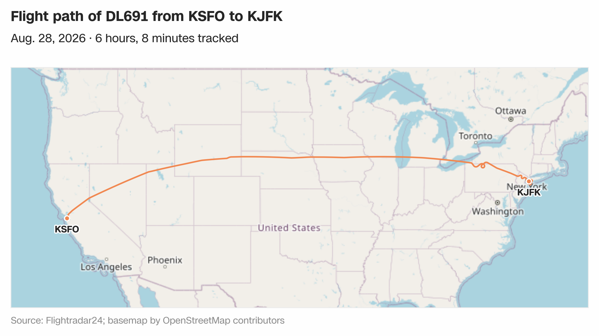
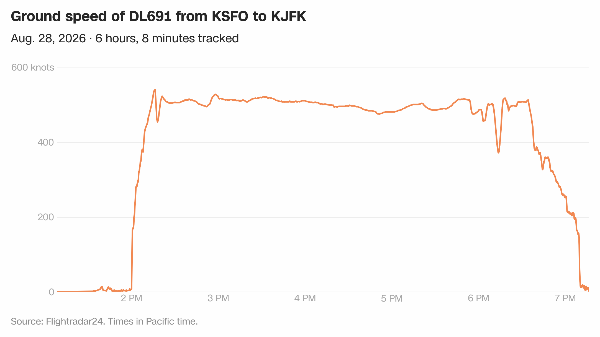

# Pyfr24

[](https://pyfr24.readthedocs.io/en/latest/?badge=latest)

A Python client for the [Flightradar24 API](https://fr24api.flightradar24.com/) that provides an interface to fetch, plot and analyze flight data. The package includes both a Python API and a command-line interface for accessing flight data.

**Full documentation:** [https://pyfr24.readthedocs.io/](https://pyfr24.readthedocs.io/)

## Installation

```bash
# Install from PyPI
pip install pyfr24

# Or from source
git clone https://github.com/stiles/pyfr24.git
cd pyfr24
pip install -e .
```

## Basic usage

### Python API

```python
from pyfr24 import FR24API

# Initialize the client
api = FR24API("your_api_token")

# Get flight tracks for a specific flight ID
tracks = api.get_flight_tracks("39bebe6e")

# Export flight data with enhanced features
output_dir = api.export_flight_data(
    "39bebe6e",
    background='esri-satellite',  # Satellite background
    aspect='16:9',                # Fixed 16:9 output
    timezone='America/New_York'   # Convert to Eastern Time
)
```

**Full Python docs:** [https://pyfr24.readthedocs.io/en/latest/usage/api/](https://pyfr24.readthedocs.io/en/latest/usage/api/)

### Command-line interface

```bash
# Export flight data
pyfr24 export-flight --flight-id 39a84c3c --output-dir data/flight_39a84c3c

# Get live flights for an aircraft registration
pyfr24 live-flights --registration N12345

# Get flight positions within a bounding box (Los Angeles area)
pyfr24 flight-positions --bounds "33.5,-118.8,34.5,-117.5"

# Smart export with enhanced features
pyfr24 smart-export --flight UA2151 --date 2025-04-22 \
                    --timezone "America/New_York" \
                    --background esri-satellite \
                    --aspect 3:2
```

### A flight from the news

You have a flight number and a date. `smart-export` handles the lookup and the
export together, and `--format png,svg` leaves an editable copy of every graphic
beside the PNG:

```bash
pyfr24 smart-export --flight DL691 --date 2026-08-28 \
                    --timezone "America/Los_Angeles" \
                    --background osm \
                    --format png,svg
```

```
Fetching summary...
Fetching flight tracks for flight ID: 4166af99
Converting timestamps to timezone: America/Los_Angeles
Exporting flight data to directory: data/DL691_2026-08-28_KSFO-KJFK_4166af99
CSV data saved to data/DL691_2026-08-28_KSFO-KJFK_4166af99/data.csv
GeoJSON points saved to data/DL691_2026-08-28_KSFO-KJFK_4166af99/points.geojson
GeoJSON line saved to data/DL691_2026-08-28_KSFO-KJFK_4166af99/line.geojson
KML file saved to data/DL691_2026-08-28_KSFO-KJFK_4166af99/track.kml
Map saved to data/DL691_2026-08-28_KSFO-KJFK_4166af99/map.png
Map saved to data/DL691_2026-08-28_KSFO-KJFK_4166af99/map.svg
...
Exporting files...

Exporting flight 4166af99 (DL691) from KSFO to KJFK on 2026-08-28T14:00–2026-08-28T19:10
Output directory: data/DL691_2026-08-28_KSFO-KJFK_4166af99
Files created:
  - data.csv: CSV of flight track points
  - points.geojson: GeoJSON of track points
  - line.geojson: GeoJSON LineString connecting the points
  - track.kml: Flight path in KML format
  - map.png, map.svg: Map of the flight path
  - speed.png, speed.svg: Line chart of speed over time
  - altitude.png, altitude.svg: Line chart of altitude over time
  - toplines.json: Topline summary of the exported flight

Export complete!
```

The map that produces, San Francisco to New York over OpenStreetMap:



Look south of Buffalo and the route ties a small knot. The aircraft flew a full
circle at 39,000 feet between 6:08 and 6:17 p.m. before carrying on to JFK, and
the ground speed chart from the same export shows the dip underneath it:



Most of that 145-knot drop is the tailwind the aircraft gave up when it turned
back into the jet stream rather than any real braking, which
[`examples/`](examples/) works through. The graphics and `toplines.json` from
this exact run are committed there.

More worked examples, including several aspect ratios of one flight, Mapbox
backgrounds and timezone conversion, are in the CLI reference.

**Full CLI reference:** [https://pyfr24.readthedocs.io/en/latest/usage/cli/](https://pyfr24.readthedocs.io/en/latest/usage/cli/)

## API token

Your Flightradar24 API token can be provided:

1. Via environment variable:
   ```bash
   export FLIGHTRADAR_API_KEY="your_api_token"
   ```

2. As a command-line argument:
   ```bash
   pyfr24 --token "your_api_token" flight-summary --flight BA123
   ```

3. Through an interactive prompt when no token is provided

## Smart export (new!)

Easily export all data for a flight when you know the flight number and date, but not the internal flight ID. This command is ideal for quickly investigating incidents or flights reported in the news, as it will look up all matching flights for the given number and date, prompt you to select if there are multiple, and export all relevant data and visualizations in one step.

Export all data for a flight by flight number and date, with interactive selection if there are multiple matches:

```bash
pyfr24 smart-export --flight UA2151 --date 2025-04-22
```

- If multiple flights are found, you'll be prompted to select the correct one.
- The output directory is named automatically (e.g., `data/UA2151_2025-04-22_KEWR-KDEN_3a01b036`).
- A `toplines.json` file is created with a summary of the exported flight.

**Example output:**
```
Multiple flights found for UA2151 on 2025-04-22:
[0] 3a00e15e | KPWM  KEWR | 2025-04-22T10:34–2025-04-22T11:46 | N37554 | B39M
[1] 3a01b036 | KEWR  KDEN | 2025-04-22T14:48–2025-04-22T18:53 | N28457 | B739
Select a flight to export [0-1]: 1
...
Export complete!
```

## Features

- **Flight data retrieval** (live flights, historical tracks and detailed info)
- **Publication-ready visualizations**:
  - Headline, dek and source line laid out around every map and chart
  - Fixed aspect ratios (16:9, 3:2, 4:3, 1:1, 9:16) that the saved file matches exactly
  - Key-free map backgrounds from OpenStreetMap (default), Esri and OpenTopoMap, plus Mapbox with your own token
  - Origin and destination marked and labeled on the map, with an aircraft still in the air marked as such rather than as arrived
  - PNG, SVG and PDF output, with editable type in the vector formats
  - Timezone conversion with automatic DST handling
  - AP-style dates and time axes that don't collide
  - Gaps in ADS-B coverage left as gaps, including on flights across the date line
  - Readings no aircraft could have produced dropped rather than drawn, and estimated speeds labeled as estimates
- **Data export** in multiple formats (CSV, GeoJSON and KML)
- **Interactive CLI** export by flight number and date (`smart-export` command)
- **Comprehensive output** including topline summaries (`toplines.json`)
- **Robust error handling** and logging
- **Comprehensive testing**

## Contributing

Contributions are welcome. Please:

1. Fork the repository
2. Create a feature branch
3. Add tests for new functionality
4. Ensure all tests pass with `python run_tests.py`
5. Submit a pull request

## License

This project is licensed under the MIT License.
