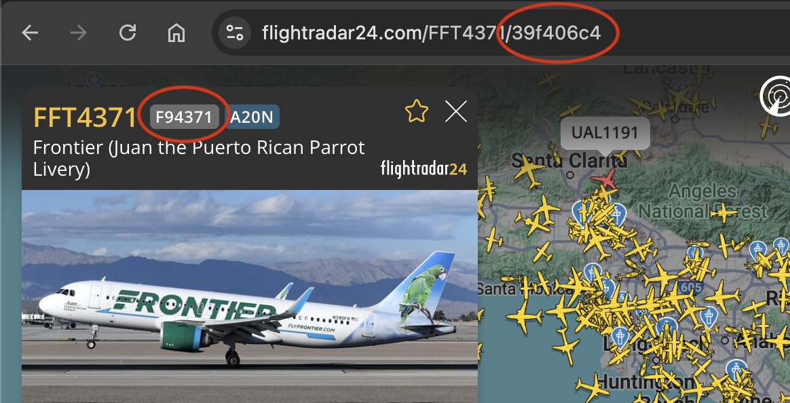

# Python API reference

## Understanding Flight Identifiers

When working with flight data, it's important to understand the different types of identifiers:

### Flight Numbers vs Callsigns vs FR24 IDs



Using Frontier Airlines flight FFT4371 as an example:

- **Flight Number** (e.g., `F94371`): The commercial flight number shown to passengers
- **Callsign** (e.g., `FFT4371`): The radio callsign used by ATC (FFT = Frontier)
- **FR24 ID** (e.g., `39f406c4`): Flightradar24's unique identifier for a specific flight instance

The FR24 ID is unique to each flight instance, while flight numbers and callsigns can be reused daily.

## Basic usage

```python
import os
from pyfr24 import FR24API, configure_logging

# Configure logging (optional)
configure_logging(level=logging.INFO, log_file="pyfr24.log")

# Initialize the API client
token = os.environ.get("FLIGHTRADAR_API_KEY")
api = FR24API(token)
```

## Flight data methods

### Get live flights

```python
# Get live flights for a specific aircraft registration
live_flights = api.get_live_flights_by_registration("HL7637")
```

### Get flight summary

You can retrieve flight summaries using either flight numbers or FR24 IDs:

```python
# Get basic flight summary using flight number
summary_light = api.get_flight_summary_light(
    flights="UA1930",  # United Airlines flight 1930
    flight_datetime_from="2025-04-18T00:00:00Z",
    flight_datetime_to="2025-04-18T23:59:59Z"
)

# Get basic flight summary using FR24 ID
summary_light = api.get_flight_summary_light(
    flight_ids="39f406c4",  # Specific instance of Frontier flight 4371
    flight_datetime_from="2025-04-18T00:00:00Z",
    flight_datetime_to="2025-04-18T23:59:59Z"
)

# Get detailed flight summary for multiple flights
summary_full = api.get_flight_summary_full(
    flights=["UA1930", "UA253"],  # Multiple flight numbers
    flight_datetime_from="2025-04-18T00:00:00Z",
    flight_datetime_to="2025-04-18T23:59:59Z"
)

# Example response structure:
{
    'data': [{
        'fr24_id': '39f406c4',
        'flight': 'F94371',        # Flight number
        'callsign': 'FFT4371',     # ATC callsign
        'operating_as': 'FFT',     # Operator code
        'type': 'A20N',           # Aircraft type
        'reg': 'N390FR',          # Aircraft registration
        'orig_icao': 'KDEN',      # Origin airport
        'dest_icao': 'KSNA',      # Destination airport
        'datetime_takeoff': '2025-04-18T16:25:31Z',
        'datetime_landed': None,
        'flight_ended': False
    }]
}
```

### Get flight tracks

```python
# Get flight tracks using the flight ID
tracks = api.get_flight_tracks("39bebe6e")
```

## Data export

### Export flight data

```python
# Basic export
output_dir = api.export_flight_data("39bebe6e")

# Export with different background maps
output_dir = api.export_flight_data("39bebe6e", background='osm')  # OpenStreetMap
output_dir = api.export_flight_data("39bebe6e", background='stamen')  # Stamen Terrain
output_dir = api.export_flight_data("39bebe6e", background='esri')  # ESRI World TopoMap
# Default is CartoDB Positron (light gray)

# Export with different orientations
output_dir = api.export_flight_data("39bebe6e", orientation='horizontal')  # 16:9
output_dir = api.export_flight_data("39bebe6e", orientation='vertical')    # 9:16
output_dir = api.export_flight_data("39bebe6e", orientation='auto')       # Auto-detect
```

The export creates a directory containing:
- `data.csv`: CSV of flight track points
- `points.geojson`: GeoJSON of track points
- `line.geojson`: GeoJSON LineString connecting the points
- `track.kml`: Flight path in KML format
- `map.png`: Map visualization of the flight path
- `speed.png`: Line chart of speed over time
- `altitude.png`: Line chart of altitude over time

## Airline and airport information

### Get airline information

```python
# Get basic airline info
airline_light = api.get_airline_light("AAL")
```

### Get airport information

```python
# Get detailed airport info
airport_full = api.get_airport_full("LHR")
```

## Flight positions and IDs

### Get flight positions

```python
# Get flight positions within bounds
positions = api.get_flight_positions_light("33.5,-118.8,34.5,-117.5")
```

### Get flight IDs

```python
# Get flight IDs for an aircraft registration
flight_ids = api.get_flight_ids_by_registration(
    registration="N216MH",
    date_from="2025-01-01",
    date_to="2025-04-10"
)
```

## Error handling

```python
from pyfr24 import FR24API, FR24AuthenticationError, FR24NotFoundError

try:
    api = FR24API("your_token")
    data = api.get_flight_summary_light(
        flights="AA123",
        flight_datetime_from="2023-01-01T00:00:00Z",
        flight_datetime_to="2023-01-01T23:59:59Z"
    )
except FR24AuthenticationError as e:
    print(f"Authentication error: {e}")
except FR24NotFoundError as e:
    print(f"Flight not found: {e}")
except Exception as e:
    print(f"Unexpected error: {e}")
```

## Logging configuration

```python
import logging
from pyfr24 import configure_logging

# Configure logging with default settings
configure_logging()

# Configure logging with custom settings
configure_logging(
    level=logging.DEBUG,
    log_file="pyfr24.log",
    log_format="%(asctime)s - %(levelname)s - %(message)s"
)
``` 